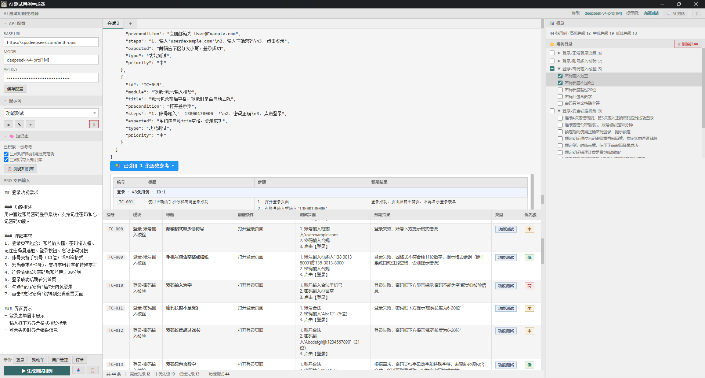

<p align="center">
  
  
  
  
  
</p>

<h1 align="center">AI 测试用例生成器</h1>

<p align="center">
  <b>粘贴 PRD → AI 分析 → 流式生成 → 一键导出 Excel</b><br>
  <sub>DeepSeek V4 / Qwen3.7-Plus 双模型驱动 · 思考模式 · 图文多模态 · 多轮对话 · 本地运行，数据安全</sub>
</p>

---

<table>
<tr>
  <td><b>流式生成 & 多轮对话</b></td>
  <td><b>Excel 导出效果</b></td>
</tr>
<tr>
  <td></td>
  <td></td>
</tr>
</table>

---

## 为什么用它

- 传统手工写用例：一份 PRD 动辄几十条用例，逐条编写耗时且容易遗漏边界场景
- 用 ChatGPT 网页版：每次粘贴、复制、排版，无法导出标准 Excel，上下文容易丢失
- **这个工具**：粘贴 PRD → 流式出结果 → 表格预览 → 一键下载 `.xlsx`，全程 30 秒

---

## 功能

| 模块 | 说明 |
|------|------|
| 🧠 **AI 驱动** | DeepSeek V4 Pro + Qwen3.7-Plus 双模型，思考模式，覆盖功能/边界/异常/安全多维测试 |
| 🖼️ **图文多模态** | Qwen 模型支持粘贴/拖拽截图，结合 PRD 文字与界面截图一起生成用例 |
| ⚡ **流式输出** | SSE 实时推流，思考过程与生成内容同步展示，支持随时终止 |
| 💬 **多轮对话** | 生成后可追加需求（"再补 5 条性能用例"），完整上下文保留 |
| 📑 **多会话** | 标签式管理，同时处理多个 PRD，互不干扰；生成中禁止切换防止内容丢失 |
| 🧠 **知识库** | 自动积累历史用例，生成时检索相似 PRD 并注入参考范例；同会话去重合并 |
| 🔍 **手动去重** | 一键分析知识库重复记录，包含匹配展示重复/新增标题，确认后合并删除 |
| 📝 **提示词管理** | 内置 3 套策略，支持在线编辑/新增，自动持久化 |
| 📥 **Excel 导出** | 表头蓝底白字、优先级行着色（红/橙/绿）、冻结首行、自动筛选 |
| 📂 **用例目录** | 右侧面板按模块分组树形目录，点击定位详情，表格联动高亮 |

## 快速开始

### 方式一：桌面版（双击即用，原生窗口）

1. 下载 [Releases](https://gitee.com/liu-jiahui007/ai-test-case-gen/releases) 中的 `AiTestCaseGen.exe`
2. 双击启动 → 弹出原生桌面窗口
3. 左侧填入 API Key → 保存 → 开始使用

### 方式二：源码运行（开发者）

```bash
# 1. 克隆 & 安装
git clone https://gitee.com/liu-jiahui007/ai-test-case-gen && cd AiTestCaseGen
python -m venv .venv && source .venv/bin/activate   # Windows: .venv\Scripts\activate
pip install -r requirements.txt

# 2. 启动 Web 版
python app.py
# → 浏览器打开 http://127.0.0.1:5000

# 3. 启动桌面版
python desktop.py
# → 原生窗口打开

# 4. 配置 API
# 左侧面板填入 Base URL / Model / API Key → 保存
```

### 方式三：自行打包 exe

```bash
pip install pywebview pyinstaller
pyinstaller AiTestCaseGen.spec
# → dist/AiTestCaseGen.exe
```

---

## 项目结构

```
AiTestCaseGen/
├── app.py                      # Web 版入口
├── desktop.py                  # 桌面版入口（pywebview 原生窗口）
├── AiTestCaseGen.spec          # PyInstaller 打包配置
├── requirements.txt
├── config/settings.py          # 默认配置
├── builtin_prompts.json         # 提示词运行时数据（自动持久化，默认值在 testcase_prompt.py）
├── prompts/
│   └── testcase_prompt.py      # 提示词定义与内置默认值
├── services/
│   ├── ai_client.py            # API 客户端（流式 + 非流式 + 思考模式 + 重试）
│   ├── excel_builder.py        # Excel 生成
│   └── memory_store.py         # 知识库（SQLite 存储 + 关键词检索 + 去重）
├── routes/
│   ├── api.py                  # /api/* 全部接口（含速率限制）
│   └── pages.py                # 页面路由
├── utils/
│   ├── logger.py               # 日志（控制台 + 文件）
│   └── json_parser.py          # JSON 提取
├── static/
│   ├── style.css                # 样式（亮/暗双主题变量）
│   └── app.js                  # 前端逻辑（会话、流式、面板拖拽）
├── templates/index.html        # 前端页面
├── logs/                       # 运行日志
└── image/                      # 截图
```

---

## API

| 端点 | 说明 |
|------|------|
| `POST /api/generate/stream` | 流式生成测试用例（SSE，DeepSeek） |
| `POST /api/generate/stream/multimodal` | 千问多模态流式生成（SSE，支持图片） |
| `POST /api/generate` | 非流式生成 |
| `POST /api/chat` | 多轮对话 |
| `POST /api/chat/stream` | 流式多轮对话（SSE） |
| `GET /api/prompts` | 获取提示词列表 |
| `POST /api/prompts` | 保存提示词 |
| `POST /api/export` | 导出 Excel |
| `GET/POST/PUT/DELETE /api/knowledge/*` | 知识库 CRUD、检索、去重预览/执行 |
| `POST /api/log` | 前端日志上报 |
