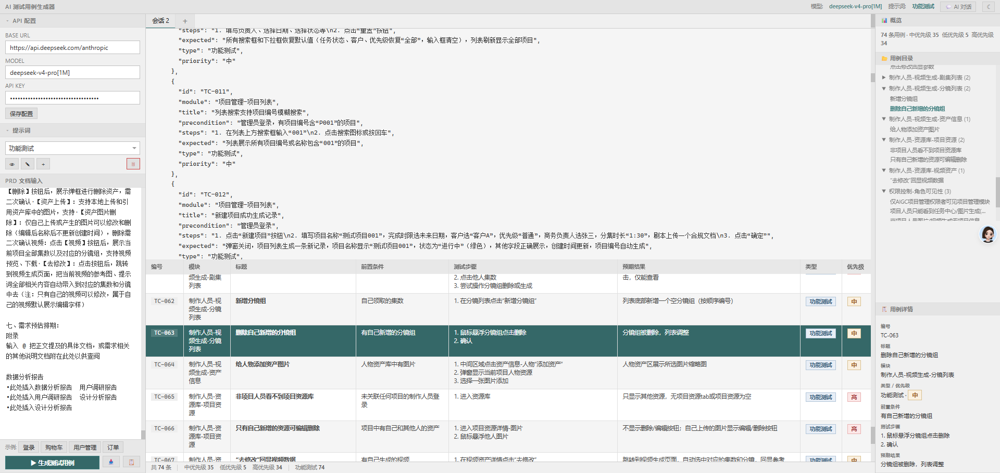
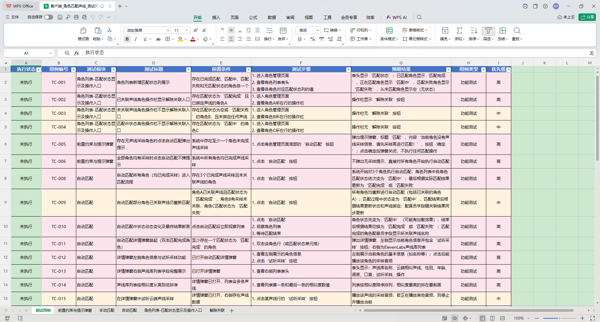

<p align="center">
  
  
  
  
</p>

<h1 align="center">AI 测试用例生成器</h1>

<p align="center">
  <b>粘贴 PRD → AI 分析 → 流式生成 → 一键导出 Excel</b><br>
  <sub>基于 DeepSeek V4 模型驱动 · 思考模式 · 多轮对话 · 本地运行，数据安全</sub>
</p>

---

<table>
<tr>
  <td><b>流式生成 & 多轮对话</b></td>
  <td><b>Excel 导出效果</b></td>
</tr>
<tr>
  <td></td>
  <td></td>
</tr>
</table>

---

## 为什么用它

- 传统手工写用例：一份 PRD 动辄几十条用例，逐条编写耗时且容易遗漏边界场景
- 用 ChatGPT 网页版：每次粘贴、复制、排版，无法导出标准 Excel，上下文容易丢失
- **这个工具**：粘贴 PRD → 流式出结果 → 表格预览 → 一键下载 `.xlsx`，全程 30 秒

---

## 功能

| 模块 | 说明 |
|------|------|
| 🧠 **AI 驱动** | DeepSeek V4 Pro 模型 + 思考模式，覆盖功能/边界/异常/安全多维测试 |
| ⚡ **流式输出** | SSE 实时推流，思考过程与生成内容同步展示，支持随时终止 |
| 💬 **多轮对话** | 生成后可追加需求（"再补 5 条性能用例"），完整上下文保留 |
| 📑 **多会话** | 标签式管理，同时处理多个 PRD，互不干扰 |
| 📝 **提示词管理** | 内置 3 套策略，支持在线编辑/新增，自动持久化 |
| 📥 **Excel 导出** | 表头蓝底白字、优先级行着色（红/橙/绿）、冻结首行、自动筛选 |
| 🌓 **双主题** | 亮色/暗色一键切换，偏好自动保存 |
| 📋 **快速模板** | 内置登录/购物车/用户管理/订单管理 4 套示例 PRD，新用户即刻体验 |

---

## 快速开始

```bash
# 1. 克隆 & 安装
git clone <repo-url> && cd AiTestCaseGen
python -m venv .venv && source .venv/bin/activate   # Windows: .venv\Scripts\activate
pip install -r requirements.txt

# 2. 启动
python app.py
# → 浏览器打开 http://127.0.0.1:5000

# 3. 配置 API
# 左侧面板填入 Base URL / Model / API Key → 保存
```

---

## 项目结构

```
AiTestCaseGen/
├── app.py                      # 入口
├── requirements.txt
├── config/settings.py          # 默认配置
├── prompts/
│   ├── testcase_prompt.py      # 提示词定义
│   └── builtin_prompts.json    # 提示词数据（页面编辑自动同步）
├── services/
│   ├── ai_client.py            # API 客户端（流式 + 非流式 + 思考模式）
│   └── excel_builder.py        # Excel 生成
├── routes/
│   ├── api.py                  # /api/* 全部接口
│   └── pages.py                # 页面路由
├── utils/
│   ├── logger.py               # 日志（控制台 + 文件）
│   └── json_parser.py          # JSON 提取
├── templates/index.html        # 前端 SPA
├── logs/                       # 运行日志
└── image/                      # 截图
```

---

## API

| 端点 | 说明 |
|------|------|
| `POST /api/generate/stream` | 流式生成测试用例（SSE） |
| `POST /api/generate` | 非流式生成 |
| `POST /api/chat` | 多轮对话 |
| `POST /api/chat/stream` | 流式多轮对话（SSE） |
| `GET /api/prompts` | 获取提示词列表 |
| `POST /api/prompts` | 保存提示词 |
| `POST /api/export` | 导出 Excel |
| `POST /api/log` | 前端日志上报 |

---

## 配置

`config/settings.py`：

```python
DEFAULT_BASE_URL = "https://api.deepseek.com/anthropic"
DEFAULT_MODEL    = "deepseek-v4-pro[1M]"
MAX_TOKENS       = 16384
API_TIMEOUT      = 180
```
